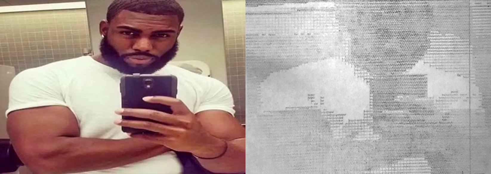

# What is this?

I remember seeing some TikTok a while ago where a dude stuck a pen to his printer and made it write an essay with Chat GPT or something. It's a cool idea, but if I did that, I wouldn't be publishing it on GitHub for my school to see and then suspend me or something. Instead, I only borrowed the concept of attatching a pen to my 3D printer and thought it'd be cool to draw some stuff.

This repository contains a tool written in HTML and JS to convert image files into .gcode instructions for a 3D printer. I know it's unoptimized spaghetti, but I wrote 90% of it in the span of two school nights when I should've been studying for my calculus test. Sue me.

# How does it work?

This program takes an image and divides it into rectangles. It then gets the average darkness of each rectangle using pixel data. From this darkness value, a number of lines is chosen to be drawn at every cell in the grid. Finally, this information is converted into instructions for the 3D printer in the .gcode file format, of course after some optimization, such as combining adjacent lines and drawing lines in a boustrophedon-inspired way.

Here's an illustration of this proccess with an actual drawing made from this program: 

# How to use

Just download this repository and open the `index.html` file or just go [here](https://arjhantoteck.vercel.app/da%20vinci%20machine/). Upload your image, choose your grid settings, and set the physical size of the image. Make sure to adjust the offset based on the distance between the 3D printer nozzle and the actual pen. You will probably also need to lower the Z axis a bit to make sure the lines are dark enough. When you're done, download the file and put it into your 3D printer.

